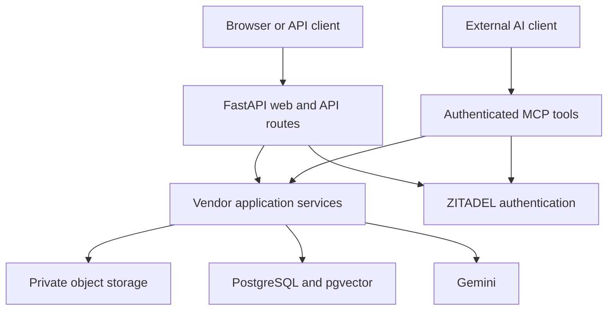

# Vendor Risk Analyzer

A FastAPI application for reviewing vendor security and compliance documents,
generating evidence-grounded risk assessments, and asking questions about a
vendor's documented controls.

The project combines Python, FastAPI, SQLAlchemy, Alembic, PostgreSQL with
pgvector, private S3-compatible object storage, Gemini, ZITADEL authentication,
and an optional authenticated Model Context Protocol (MCP) server. The browser
interface uses Jinja2 templates and JavaScript. uv manages Python dependencies.

## Key Features

- Vendor records and separate document and assessment views
- Parsing for PDF, DOCX, CSV, XLSX, plain text, and Markdown
- Structure-aware chunks with heading context, table metadata, and text overlap
- Automatic embedding worker with startup retries and stale-document recovery
- Persistent 768-dimensional embeddings and a pgvector HNSW cosine index
- Vendor-scoped semantic retrieval from ready documents
- Structured risk findings with references to retrieved evidence
- Deterministic finding consolidation and summaries aligned with the final findings
- Deterministic policy rules for severity and overall risk
- Saved assessment reports and evidence-grounded chat with source citations
- ZITADEL browser login, Viewer/Analyst/Admin permissions, and CSRF protection
- Optional JWT bearer authentication for API clients and six authenticated MCP tools
- Local Docker Compose setup with PostgreSQL and private MinIO storage
- Automated unit, HTTP security, startup, and Docker integration checks

## Architecture



The embedding worker and optional MCP transport run inside the FastAPI process.
Compose provides the application, database, and object storage locally. ZITADEL
and Gemini remain external services.

## Assessment Workflow

1. An Analyst or Admin creates a vendor and uploads its security documents.
2. The browser uploads the original file to private object storage using a signed URL.
3. Document processing selects a parser, saves structural elements, and creates retrieval chunks.
4. The document enters `embedding_pending`. The worker embeds missing chunks, verifies the stored vectors, and marks the document `ready` when processing is complete.
5. Assessment retrieval searches ready documents for the selected vendor across risk-analysis topics and combines repeated evidence hits.
6. Gemini returns a structured summary and findings. Grounding checks verify cited chunk IDs against the retrieved evidence.
7. Deterministic logic consolidates duplicate findings and rebuilds the summary when the finding set changes, without another LLM call.
8. The application persists the assessment and findings, applies deterministic risk policy, and displays the saved report.

Findings distinguish three types:

| Finding type | Meaning |
| --- | --- |
| `contradiction` | The retrieved evidence contains conflicting statements. |
| `evidence_gap` | The retrieved evidence does not sufficiently establish a control. |
| `explicit_risk` | The evidence describes a risk or open issue. |

The LLM identifies risk signals; policy rules assign final severity. Rules do not
cover every finding type/category combination, so unmatched findings can remain
`unrated`. Numeric `overall_score` is currently left unset. A report with no
findings is supported; it does not prove that every possible risk was assessed.

## Data Storage

| Data | Storage | Purpose |
| --- | --- | --- |
| Vendor records | PostgreSQL `vendors` | Vendor identity, website, status, and metadata |
| Original uploaded files | Private S3-compatible bucket | Retains the source documents; MinIO supplies this locally |
| Document records | PostgreSQL `documents` | Vendor association, filename, object key, processing status, and parser metadata |
| Parsed elements | PostgreSQL `document_elements` | Paragraphs, headings, tables, page/sheet context, and source structure |
| Retrieval chunks | PostgreSQL `document_chunks` | Searchable content, source-element references, and chunk metadata |
| Embeddings | pgvector in `document_chunks` | 768-dimensional vectors for semantic search |
| Assessments and findings | PostgreSQL `assessments` and `findings` | Saved summaries, evidence references, policy results, and risk fields |

Parsed elements preserve document structure; chunks provide the smaller units
used for retrieval. Reprocessing replaces a document's previous elements and
chunks, and the worker then generates embeddings for the new chunks. Chat
conversation history is not persisted by the server.

## Chunking and Retrieval

Chunking uses heading context, keeps tables as separate retrieval units, and
excludes navigation-only entries from retrieval. Default text chunk settings are
1,200 characters, one overlapping source element, and 160 characters of overlap
when splitting an oversized text element. Table chunks preserve their structural
metadata and use table-specific grouping.

A query is embedded with Gemini and searched using pgvector cosine distance.
Search is restricted to the selected vendor, documents with status `ready`, and
chunks matching the active embedding model and dimension. Chat retrieves up to
five chunks; assessment analysis collects evidence across several risk topics.

| Setting | Use |
| --- | --- |
| `EMBEDDING_MODEL` | Gemini model used to embed document chunks and queries |
| `EMBEDDING_DIMENSIONS=768` | Must match the current database vector schema |
| `RISK_LLM_MODEL` | Gemini model used for structured risk analysis |
| `CHAT_LLM_MODEL` | Optional chat model override; otherwise chat uses `RISK_LLM_MODEL` when set |

Choose models available to your Gemini account. Changing embedding dimensions
requires a corresponding schema change and regeneration of stored vectors.
Changing embedding models also requires regenerating document embeddings before
those chunks can match queries using the new model.

## Project Structure

| Path | Responsibility |
| --- | --- |
| [src/vendor_risk_analyzer/api/](src/vendor_risk_analyzer/api/) | Vendor, document, assessment, chat, and health HTTP routes |
| [src/vendor_risk_analyzer/auth/](src/vendor_risk_analyzer/auth/) | OIDC login/logout, sessions, roles, CSRF, and JWT verification |
| [src/vendor_risk_analyzer/ingestion/](src/vendor_risk_analyzer/ingestion/) | File parsers, structural elements, chunking, and ingestion |
| [src/vendor_risk_analyzer/embeddings/](src/vendor_risk_analyzer/embeddings/) | Gemini embeddings, worker lifecycle, and shared persistence helpers |
| [src/vendor_risk_analyzer/retrieval/](src/vendor_risk_analyzer/retrieval/) | Vendor-scoped pgvector search |
| [src/vendor_risk_analyzer/risk_analysis/](src/vendor_risk_analyzer/risk_analysis/) | Structured analysis, grounding checks, and finding consolidation |
| [src/vendor_risk_analyzer/risk_policy/](src/vendor_risk_analyzer/risk_policy/) | Deterministic severity and overall-risk rules |
| [src/vendor_risk_analyzer/assessments/](src/vendor_risk_analyzer/assessments/) | Assessment persistence and shared saved-report construction |
| [src/vendor_risk_analyzer/mcp/](src/vendor_risk_analyzer/mcp/) | Authenticated Streamable HTTP MCP tools |
| [src/vendor_risk_analyzer/db/](src/vendor_risk_analyzer/db/) | SQLAlchemy models, sessions, and database URL normalization |
| [src/vendor_risk_analyzer/storage/](src/vendor_risk_analyzer/storage/) | Private object storage and signed uploads |
| [src/vendor_risk_analyzer/web/](src/vendor_risk_analyzer/web/), [templates/](src/vendor_risk_analyzer/templates/), [static/](src/vendor_risk_analyzer/static/) | Browser pages, navigation, templates, CSS, and JavaScript |
| [migrations/](migrations/) | Alembic schema migrations, vector dimensions, and HNSW index |
| [scripts/local/](scripts/local/), [scripts/ops/](scripts/ops/), [scripts/smoke/](scripts/smoke/) | Local bucket setup, maintenance tasks, and live integration checks |
| [tests/](tests/), [tests/security/](tests/security/) | Automated regression and HTTP security tests |
| [docs/](docs/) | Detailed local setup, API authentication, and MCP guides |
| [Dockerfile](Dockerfile), [docker-compose.yml](docker-compose.yml), [docker/](docker/) | Application image and local supporting services |
| [pyproject.toml](pyproject.toml), [uv.lock](uv.lock), [requirements.txt](requirements.txt) | Dependency definitions, locked versions, and optional pip export |
| [.github/workflows/](.github/workflows/) | CI and manually triggered integration smoke checks |

## Prerequisites

- Git
- Docker Desktop on macOS/Windows, or Docker Engine with Compose v2 on Linux; use Linux containers
- A ZITADEL project and OIDC application for actual sign-in
- A Gemini API key for embeddings, assessments, and AI chat
- uv and Python 3.12 when running Python commands outside Docker

The application image includes Python and uses uv. Host Python is not required
for the full Compose setup. The public sign-in page and health checks can start
with example settings, but the complete application needs the external services.

## Local Setup

### 1. Clone the repository

```bash
git clone https://github.com/bhuwanbkt/vendor-risk-analyzer.git
cd vendor-risk-analyzer
```

### 2. Prepare your private settings

For a new checkout:

```bash
cp .env.example .env
```

If `.env` already exists, keep it and update the settings needed for your setup.
Only `.env.example` is tracked in Git. The real `.env` is ignored and excluded
from the Docker build context.

Generate a session secret using Docker, then paste the value into `SESSION_SECRET`:

```bash
docker run --rm python:3.12-slim python -c "import secrets; print(secrets.token_hex(32))"
```

The main setting groups are:

| Settings | What to configure |
| --- | --- |
| `ZITADEL_ISSUER`, `ZITADEL_CLIENT_ID`, `ZITADEL_PROJECT_ID` | Your identity-provider instance, application client, and project |
| `ZITADEL_REDIRECT_URI`, `ZITADEL_POST_LOGOUT_URI` | Exact callback and return URLs registered in ZITADEL |
| `SESSION_SECRET`, `SESSION_COOKIE_SECURE` | Session signing and HTTPS cookie behavior |
| `DATABASE_URL` | PostgreSQL connection; the example uses host port 5433 for native Python |
| `OBJECT_STORAGE_ENDPOINT`, `OBJECT_STORAGE_PUBLIC_ENDPOINT` | Storage client endpoint and browser-facing endpoint for signed uploads |
| `OBJECT_STORAGE_REGION` | Region used by the storage client for requests and signing; local MinIO uses `us-east-1` |
| `OBJECT_STORAGE_ACCESS_KEY_ID`, `OBJECT_STORAGE_SECRET_ACCESS_KEY`, `OBJECT_STORAGE_BUCKET` | Storage credentials and private bucket name |
| `GEMINI_API_KEY`, `EMBEDDING_MODEL`, `RISK_LLM_MODEL` | AI provider key and models available to your account |
| `EMBEDDING_WORKER_ENABLED` | Enable automatic embeddings after configuring Gemini; the example sets `false` |
| `API_BEARER_ENABLED`, `MCP_ENABLED`, `MCP_PUBLIC_URL` | Optional API-token and MCP access, described below |

The full template also contains local ports, local database/storage credentials,
embedding dimensions, and worker timing settings. Compose overrides the database
and storage addresses with its internal service names. For native Python, keep
host URLs and credentials consistent with your local ports and Compose settings.

### 3. Configure ZITADEL login

Use a separate development application with Authorization Code, S256 PKCE, and
token endpoint authentication method `none`. This application uses a client ID
and does not send a client secret. Enable ZITADEL Development mode for HTTP
localhost callbacks and register:

- Callback: `http://localhost:8000/auth/callback`
- After logout: `http://localhost:8000/`

Replace the issuer/client/project placeholders in `.env`. Create the lowercase
project roles `viewer`, `analyst`, and `admin`, enable **Assert Roles on
Authentication**, and assign a role to each app user. If you change `APP_PORT`,
update the callback/logout URLs and their ZITADEL registrations too.

### 4. Configure Gemini

Set your `GEMINI_API_KEY`, select models available to your account, and keep
`EMBEDDING_DIMENSIONS=768`. To process embeddings automatically, set:

```env
EMBEDDING_WORKER_ENABLED=true
```

With the worker disabled, ingested documents remain `embedding_pending` and are
not eligible for semantic retrieval.

### 5. Start the Compose stack

```bash
docker compose --env-file .env config --quiet
docker compose --env-file .env up --build -d
docker compose --env-file .env ps -a
docker compose --env-file .env logs -f app
```

Compose manages five services:

| Service | Role |
| --- | --- |
| `db` | PostgreSQL with pgvector and persistent database storage |
| `minio` | Private S3-compatible storage with a persistent data volume |
| `migrate` | Applies Alembic migrations after the database is healthy, then exits |
| `storage-init` | Creates the private bucket, then exits |
| `app` | Starts FastAPI after both setup jobs finish successfully |

MinIO is built from the pinned source release in [docker/minio/Dockerfile](docker/minio/Dockerfile).
The first build can take several minutes; Docker caches later builds. No host Go
installation is needed. A successful exited `migrate` or `storage-init` container
is expected.

| Service | Default local address |
| --- | --- |
| Application | http://localhost:8000 |
| Liveness | http://localhost:8000/health |
| Database readiness | http://localhost:8000/ready |
| PostgreSQL | localhost:5433 |
| MinIO S3 API | http://localhost:9000 |
| MinIO console | http://localhost:9001 |

Published ports bind to loopback. Use `localhost` consistently for the browser,
login URLs, and signed uploads. MinIO console credentials come from
`MINIO_ROOT_USER` and `MINIO_ROOT_PASSWORD`; the `vendor-documents` bucket is private.

Stop the stack while retaining its named database and storage volumes:

```bash
docker compose --env-file .env down
```

Use `--env-file .env` on every Compose command. Restart with `up --build -d` after
pulling code or changing settings. For failed startup, inspect:

```bash
docker compose --env-file .env logs migrate storage-init app
```

See [Local development](docs/local-development.md) for port changes, existing
volume credentials, and other setup details.

## Run Python with uv

Use this option when developing the application in a local Python environment.
Prepare `.env` as above and set `SESSION_COOKIE_SECURE=false` for HTTP localhost.
The app permits this only in development with localhost callback/logout URLs;
Compose applies the cookie override automatically for its own app container.

If the Compose `app` container is already running, stop it before binding Python
to the same port:

```bash
docker compose --env-file .env stop app
```

Start the supporting services, initialize storage, apply migrations, and start
FastAPI from the repository root:

```bash
docker compose --env-file .env up -d db minio
docker compose --env-file .env run --rm storage-init
uv sync --python 3.12 --frozen --no-dev
uv run --python 3.12 python -m dotenv -f .env run -- alembic upgrade head
uv run --python 3.12 uvicorn vendor_risk_analyzer.main:app --host 127.0.0.1 --port 8000 --env-file .env
```

uv creates and uses `.venv` automatically. Alembic needs the process environment,
so its command loads `.env` through `python -m dotenv`; Uvicorn loads `.env` itself.
Use Python 3.12 to match the container and CI.

`requirements.txt` is an optional pip compatibility export from `uv.lock`. The
primary setup uses uv. Dependency changes belong in `pyproject.toml` and the lock
file; see [Local development](docs/local-development.md#optional-pip-compatibility)
for the alternative installation route.

## Use the Application

1. Open [http://localhost:8000](http://localhost:8000) and sign in through ZITADEL.
2. With an Analyst or Admin account, create a vendor on the Vendors page.
3. Upload documents on the Documents page and process them.
4. Wait until the documents show `ready` before running an assessment or asking AI questions.
5. Run an assessment and inspect the saved summary, findings, evidence references, and policy results.
6. Open Chat, select the vendor, and ask a question such as: "How quickly must this vendor notify us of a security incident?"

Viewer accounts can inspect saved vendor data and reports. If the evidence does
not answer a question, chat reports insufficient evidence. Its answers cite
retrieved sources; citation checks reject missing or out-of-range source markers.

## Authentication and Access

| Application role | Access |
| --- | --- |
| `viewer` | Read vendors, documents, and assessments |
| `analyst` | Viewer access plus vendor creation, upload/processing, assessments, and AI chat |
| `admin` | Analyst access plus `/admin/system`; this does not grant ZITADEL administration rights |
| No app role | Public access-information/sign-in screen and own identity at `/auth/me`; protected data and controls are forbidden |

Roles currently apply to all vendors. Vendor-specific queries filter results to
the selected vendor, but the schema does not implement per-user ownership or
separate tenant permissions.

Browser login validates the ID token and matching UserInfo subject before creating
a signed session. Only this project's role claim grants app access. Successful
login creates a fresh CSRF token; cookie-authenticated writes require it.
Provider access and ID tokens are not stored in the application session.

Anonymous visitors see `/sign-in`, with an email/username form that starts ZITADEL
login using the entered account as `login_hint` and requests fresh authentication.
Passwords stay on ZITADEL's hosted page. Accounts without an app role see an
access message and a form to sign in with another account, without core app
navigation or controls.

Sign out clears the local session, sends the browser to ZITADEL's end-session
endpoint, and returns to the public sign-in page. Closing a tab does not sign out.
After changing roles, sign out and sign in again to refresh the application
session. Close every Incognito window before testing a fresh Incognito session.
Provider account selection and session termination still need a live browser check.

## API Access

The main application endpoints are:

| Method | Endpoint | Purpose |
| --- | --- | --- |
| GET | `/health` | Public application liveness |
| GET | `/ready` | Public database readiness |
| GET | `/auth/me` | Current authenticated identity |
| GET / POST | `/api/vendors` | List or create vendors |
| GET | `/api/vendors/{vendor_id}/documents` | List the vendor's documents |
| POST | `/api/vendors/{vendor_id}/documents/upload-url` | Request a signed upload URL |
| POST | `/api/vendors/{vendor_id}/documents/{document_id}/complete` | Confirm an uploaded object |
| POST | `/api/vendors/{vendor_id}/documents/{document_id}/ingest` | Parse the uploaded document and create chunks |
| POST | `/api/vendors/{vendor_id}/assessments` | Create a grounded assessment and apply policy |
| GET | `/api/assessments/{assessment_id}` | Read a saved report |
| POST | `/api/chat` | Ask a question with an explicit vendor ID |

Public Swagger/ReDoc/OpenAPI endpoints are disabled. Browser sessions authenticate
the application APIs. External clients can opt into JWT bearer access tokens by
setting `API_BEARER_ENABLED=true`; the default is `false`.

Tokens must be signed by the configured ZITADEL issuer, include this project in
the audience, and contain its project-specific roles. A verified bearer request
can write without a CSRF token; cookie-authenticated writes still require one.
An invalid bearer token never falls back to a cookie identity.

With a valid `ACCESS_TOKEN` in your private shell environment:

```bash
curl --fail-with-body -H "Authorization: Bearer $ACCESS_TOKEN" http://localhost:8000/auth/me
curl --fail-with-body -H "Authorization: Bearer $ACCESS_TOKEN" http://localhost:8000/api/vendors
```

Use HTTPS outside localhost development. See [API authentication](docs/api-authentication.md)
for client configuration, required scopes, token verification, and error responses.

## MCP Tools

An optional Streamable HTTP server exposes six tools at `/mcp` in the existing
FastAPI process. Each protocol request needs a verified ZITADEL JWT access token;
browser cookies cannot authenticate MCP. Every tool checks the caller's roles.

| Tool | Purpose | Roles |
| --- | --- | --- |
| `list_vendors` | List vendors with bounded pagination | Viewer, Analyst, Admin |
| `get_vendor` | Read a vendor by UUID | Viewer, Analyst, Admin |
| `list_vendor_documents` | List document metadata for a vendor | Viewer, Analyst, Admin |
| `list_vendor_assessments` | List saved assessments for a vendor | Viewer, Analyst, Admin |
| `get_assessment` | Read a report matching both vendor and assessment IDs | Viewer, Analyst, Admin |
| `ask_vendor` | Ask an evidence-grounded vendor question | Analyst, Admin |

After configuring API token authentication, enable local MCP in `.env`:

```env
API_BEARER_ENABLED=true
MCP_ENABLED=true
MCP_PUBLIC_URL=http://localhost:8000/mcp
```

For a hosted app, use its exact HTTPS `/mcp` URL, without a trailing slash, query,
or fragment, and restart the application. MCP needs no additional service or port.
Public OAuth Protected Resource Metadata is published at
`/.well-known/oauth-protected-resource/mcp` when enabled.

Document tools return metadata, not private object keys, signed URLs, or file
contents. `ask_vendor` calls Gemini but does not create an assessment or persist
chat history. See [MCP setup and client examples](docs/mcp.md) for OAuth setup,
input limits, and a Python SDK client using uv.

## Tests and Verification

### Automated tests

```bash
uv sync --python 3.12 --frozen --no-dev
uv run --python 3.12 --with pytest pytest -q
uv run --python 3.12 --with pytest pytest -q tests/security
```

For a coverage report:

```bash
uv run --python 3.12 --with pytest --with pytest-cov pytest -q --cov=vendor_risk_analyzer --cov-report=term-missing
```

The suite covers chunking, grounding, finding consolidation, policy rules,
application startup, worker lifecycle, OIDC login/logout, page/API roles, CSRF,
bearer token verification, vendor boundaries, and the real MCP transport/client.
It uses test-only identities and mocks external provider responses.

### GitHub Actions

[CI](.github/workflows/ci.yml) runs on pull requests and pushes to `main`:

| Job | Checks |
| --- | --- |
| `quality-and-tests` | Frozen dependency sync, requirements export, compilation, full pytest suite with coverage, and test artifacts |
| `local-runtime` | Real Docker startup, PostgreSQL/pgvector migrations, private MinIO uploads/downloads/ingestion, MCP discovery/authentication rejection, and a clean pip compatibility install |

These automated jobs do not contact ZITADEL or Gemini. They verify application
behavior and local integration; they do not establish retrieval-quality metrics
or prove hosted OAuth login and model-output quality.

### Live integration smoke checks

[Integration Smoke](.github/workflows/integration-smoke.yml) can be triggered
manually in GitHub Actions with an existing vendor UUID that has ready documents.
It requires `DATABASE_URL` and `GEMINI_API_KEY` repository secrets. It checks the
embedding provider and vendor-scoped retrieval, with an optional live risk-analysis
call. Live calls may incur provider usage charges.

See [the security test guide](tests/security/README.md) for automated coverage and
remaining provider, deployment, and retrieval-quality checks.

## Database Inspection

With the local database running, open psql:

```bash
docker compose --env-file .env exec db psql -U vendor_risk -d vendor_risk
```

Example read-only queries:

```sql
SELECT filename, status FROM documents ORDER BY created_at DESC;
SELECT document_id, sequence, vector_dims(embedding) AS dimensions
FROM document_chunks WHERE embedding IS NOT NULL LIMIT 10;
SELECT indexname FROM pg_indexes WHERE tablename = 'document_chunks';
```

## Hosted Deployment and Operations

The application [Dockerfile](Dockerfile) runs FastAPI on `PORT`, defaulting to
8000. For a hosted deployment, configure production environment variables for
your PostgreSQL/pgvector database, private S3-compatible storage, Gemini, and
ZITADEL. Use `APP_ENV=production`, HTTPS callback/logout URLs registered with
ZITADEL, a unique session secret, and `SESSION_COOKIE_SECURE=true`.

The Compose file is for local development and applies localhost overrides.
Hosted MCP also needs its public HTTPS URL and a proxy that preserves the Host.

The existing Northflank layout uses a migration job and a reusable utility job.
The embedding worker runs inside the application service. See
[Operational scripts](scripts/README.md) for the fixed job commands, dry-run
maintenance tasks, and smoke utilities. Shared embedding persistence belongs to
the application package; operational scripts import that logic.

After deployment, validate startup, sign-in/sign-out, each role and no-role
access, a sample document-to-assessment flow, and actual API/MCP client tokens.

## Current Limitations

- ZITADEL and Gemini are external dependencies; the complete local application is not offline.
- Roles grant access across vendors; per-user vendor ownership and tenant separation are not implemented.
- Policy coverage is limited, and a numeric overall-risk score is not implemented.
- Chat history is not persisted on the server.
- Automated citation checks validate references, not every factual claim in generated text.
- Automated CI does not replace hosted-login, live-model, or retrieval-quality evaluation.

## Possible Next Steps

- Expand representative retrieval and grounding evaluation datasets.
- Add vendor ownership or tenant permissions if the product requires them.
- Extend deterministic policy coverage and define a documented scoring method.
- Add persistent chat history, audit records, and richer operational monitoring.

## Further Documentation

- [Local development and optional pip compatibility](docs/local-development.md)
- [API bearer authentication](docs/api-authentication.md)
- [MCP tools and client setup](docs/mcp.md)
- [Security tests and their limits](tests/security/README.md)
- [Operational and smoke scripts](scripts/README.md)
